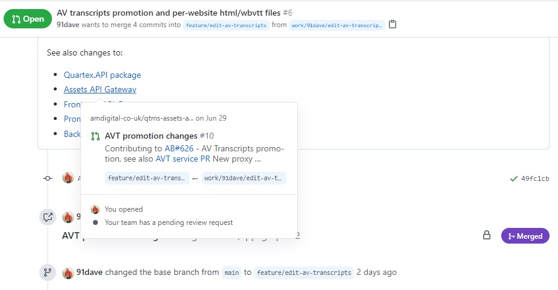

# Pull Requests
A pull request (PR) is required when [merging a child branch into a parent](/6.-Engineering/Source-Control,-Versioning-&-Branching-Strategy). 

> **NOTE:** manually merging or committing directly to a parent branch is not permitted. Firstly because it skips the PR mechanism (and therefore bypasses an important quality control step), and secondly because only a PR will trigger the relevant Continuous Integration workflows and builds.

A pull request will ideally _not_ be the first time another engineer has seen the work in progress! Think of it more as a final check; pair programming and ad-hoc discussions on possible approaches and patterns would ideally have already given one or more other engineers in the team an opportunity to see the code and provide feedback. Remember, early feedback means we can spot and rectify mistakes earlier. Doing so later in the process will require more time and effort.

## Creating a Pull Request
When an engineer has completed their work on a child branch, and has committed and pushed it to GitHub, they should visit the GitHub website and issue a pull request. This can be done either on the repository's main page (GitHub will usually prompt a user to issue a pull request if they have recently pushed a child branch), or by navigating to the **Pull requests** tab and clicking the green **New pull request** button.

When creating the pull request, the engineer submitting their work should make sure to:

- Ensure the **base** branch is correct (this should be the parent branch, e.g. a **Feature** branch when merging in a **Work** branch when working on a new feature)
- Ensure the **compare** branch is correct (this should be the engineer's **work** branch in most situations)
- Populate the _title_ with a concise summary of what is being submitted
- Populate the _body_ with an explanation of their approach to solving the problem, including any patterns used
    - Link the request to the relevant ticket in Azure DevOps by adding `AB#123` where 123 is the ID of the ticket
    - If there are PRs in other repos that are related to the same piece of work, link to them in the PR description (see hints, below)
    - This shouldn't need to be too detailed, as ideally this won't be the first time they are seeing the code
    - In the case of a shared code repository, provided the information about [version number update](/6.-Engineering/Source-Control,-Versioning-&-Branching-Strategy/Branching-&-Versioning-Shared-Code-Repositories#Versioning) (i.e. MAJOR vs MINOR vs PATCH) and why it is appropriate
- Assign their team as a reviewer

> **NOTE:** the final step will automatically assign all other team members, and only one team member needs to approve the PR. The engineer submitting the PR should communicate with the rest of their team to request a review.

## Reviewing Pull Requests & Providing Feedback
The reviewing engineer(s) should get a GitHub notification, and should review the PR at the earliest opportunity, and discuss any questions they may have or suggested changes/fixes that need to be made with the original engineer. Once the review has been completed and the reviewing engineer is happy with the changes (including any agreed changes having been completed and committed), they should approve the changes.

The original engineer is then responsible for merging the changes into the parent branch, and monitoring any CI workflows to ensure they complete successfully.

Feedback should be giving via comments in the pull request in GitHub.

Any member of the team can perform a peer review for anyone else, not just a more senior member!

## Hints for working with Pull Requests in GitHub

You can open a draft Pull Request even before the work is ready for review. When you have finished working on it, you can then click the **Ready for Review** button on the PR page.

Any further commits pushed to the same branch before the Pull Request is merged will be included. This works for both draft and non-draft PRs

**Beware**, the default behaviour is that GitHub will create a PR that merges into the `main` branch, which is rarely correct. However, it is possible to change the base of a PR before it is merged, simply by clicking the **Edit** button at the top of the PR page, and then selecting the relevant `feature` or `release` branch from the drop down.

If you add a link to another GitHub Pull Request (usually from another repo) in the body of your pull request, or within another comment, GitHub will display the status of the linked PR with the main one. Hovering over the link will show a "card" containing more details of that other PR.

