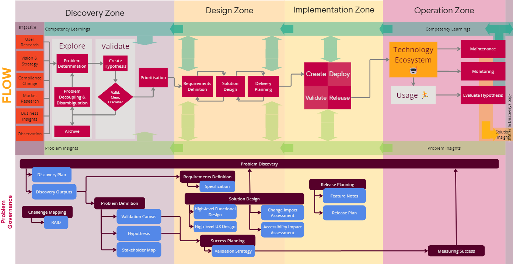

Problem Governance describes the controls we set around how we identify problems and determine solutions, and the systems we use for doing this.

By “problems” we do not just mean Product problems. Technical problems, Support problems and Operational/Business problems can also be approached using the same systems.

Problem Governance helps ensure problems are approached thoughtfully, with a clear understanding of what success will look like and who will benefit, regardless of where the problem has originated.

Before considering a solution, every problem should:

 -	Have a dedicated [Problem Owner](../Problem-Ownership/Problem-Owner.md)
 -	Be [**explored**](Research-and-Exploration.md), and all supporting evidence collated (e.g. customer and colleague feedback, user research, relevant data,  support issues).
 -	Be [**defined**](Problem-Definition.md), describing why it is a problem to the business, who is impacted by it, and the benefits that solving the problem will bring.
 -	Be [**validated**](Problem-Definition.md#components-of-defining-a-problem) as a genuine problem that’s aligned with business and department objectives, such that Platform Development should consider solving in the foreseeable future
 -	Be **prioritised** within the wider problem set (e.g. Quartex, Support, Federated Search, etc).

When planning solutions to defined problems, make sure that:

-	The [requirements](Requirements-Definition.md) of the solution are clearly defined, so it’s clear what’s in and out of scope
-	Different approaches to solving the problem are explored, documented and the rationale for the chosen path is clear
-	What [success](Measuring-Success.md) looks like is clearly articulated and understood by everyone involved in, or impacted by, the solution
-	All[ risks, assumptions, issues and dependencies](RAID-management.md) relating to the problem and its solution are captured
-	All [roles and responsibilities](../Delivery-Governance/Responsibility-Assignment.md) relating to the work are articulated and understood
-	How communication will be managed has been planned and agreed up front

