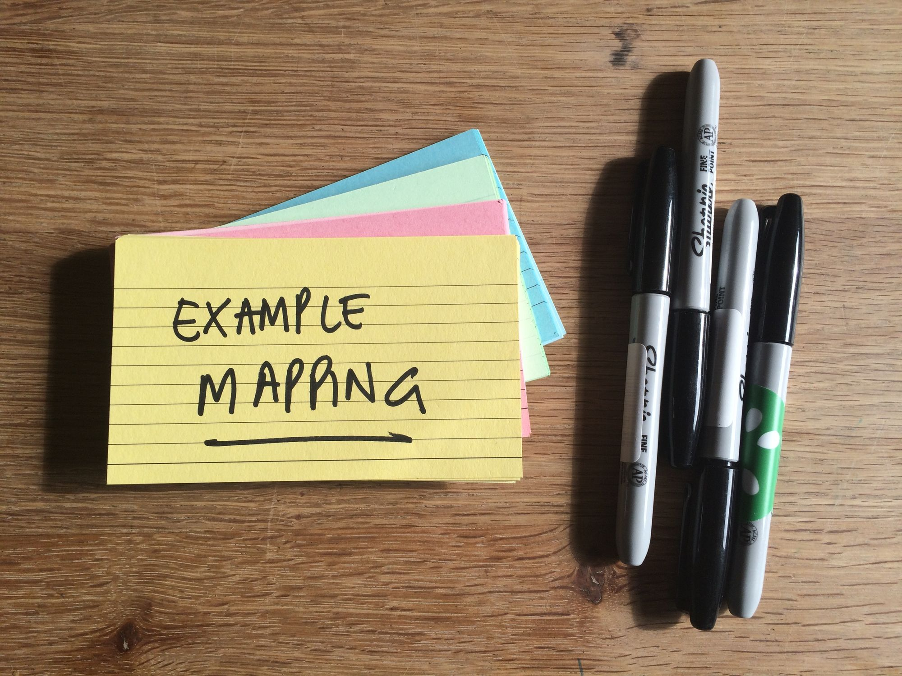
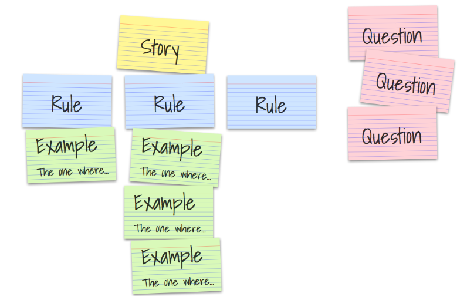
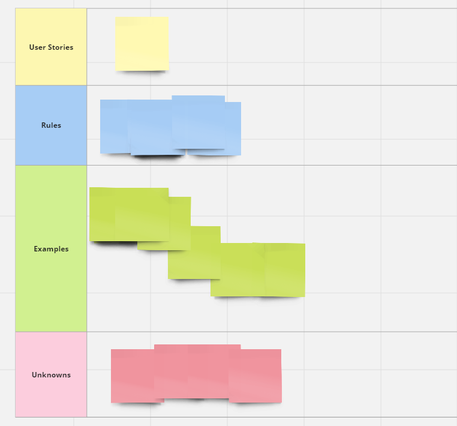

 

## What is Example Mapping?
Example Mapping, also known as Feature Mapping is a technique used for refining and establishing clearer and better-defined user acceptance criteria for a certain user story/business requirements

Through Example mapping, those directly involved in product development, such as product owners, developers, and testers, can quickly and efficiently break down the product backlog of a given product by structuring their conversations around it.

During these discussions, the team(s) participating should flesh out user acceptance criteria and draw out relevant scenarios and ask important questions associated with the product or its feature. By asking these questions and using the examples of the rules, the participants in the session can explore possible solutions and come up with the one that is optimal for both the user and the organisation developing the product.

Furthermore, this technique helps them develop a shared understanding of the path forward and the need to add, remove, or adjust certain features. Having people who cover the various aspects of product development in the same room provides an opportunity to view a user story and a potential issue from different angles. 

Product owners can provide an explanation of business rules and exemplary story scenarios, and developers and other members of the technical team can ask all the right questions about those rules and examples, while testers offer observations about how the feature will actually work.

## When should Example Mapping be used?
During the Design and Definition stage, as part of the Readying process. Normally in the form of discovery workshops or 3 Amigo's sessions. 

## What should an example mapping session identify?
-  The user acceptance criteria that will determine the constraints on the scope of a user story/business requirement.

-  Questions about the user story, or scenarios where the team isn’t certain what the expected behaviour will look like.

-  Necessary assumptions needed to move forward.

-  New product backlog items discovered during the process.

-  Product backlog items that are deferred or removed from the development. 

## What are the key benefits of Example Mapping?
-  We can breakdown a BackLog Item and understand it, preventing large BLI's entering a sprint​ in the process.

- We can Define Business rules​ related to the BLI

- Obtain a shared understanding (understanding the knowns, unknowns and answers to these)​

-  Create examples / Scenario's​

- Use those Examples to turn into Executable Specifications (Given, When, Then)​ that can drive development and automated acceptance tests

## Example mapping colours explained

 

The process of Example mapping itself involves four differently-coloured sticky notes, each for one aspect of the implementation of this technique. This is the colour-coded card system proposed by the creator of the example mapping technique, Matt Wynne:

- Yellow sticky notes should be used to define the story itself and serve as the headline for the entire example map.

- Blue sticky notes will indicate specific business and other rules directly associated with the story.

- Green sticky notes serve for defining the examples of the rules in the row above represented by the blue sticky notes.

- Red / Pink sticky notes are used for making notes of the questions that arise during the discussion. These questions can be related to the examples, rules, or the definition of the story itself.

### How does Example mapping work?
- 1 - Gather people from your team who bring different perspectives. 

- 2 - Start by picking a story (backlog item) and writing it on the yellow sticky note. This sticky note will be placed at the top of the example map, serving as a header. 

- 3 - Write the business rules or the acceptance criteria that are already known on the blue sticky notes. These cards should be placed in the first horizontal row beneath the story (yellow sticky note).

- 4 - Underneath the blue sticky notes with the rules, place green cards with one or more relevant examples for each rule written on them. (Of course, the examples should be placed under the rule they refer to. As for the format of the examples, there are no restrictions, you can use gherkin syntax, or leave them unstructured, as long as everyone understands them.)

- 5 - Write down All unanswered questions and issues that can only be resolved by people NOT currently participating in the discussion on pink sticky notes, preferably next to the example or the rule they pertain to. (As the conversation moves on and you fill the table or board with sticky notes, certain issues or misunderstandings will arise, either relating to a specific example or, perhaps the entire rule.)

### How do we define the Visual Process?
Through conversation, you’ll soon be done with the basic setup and have a visual representation of how the team currently views the story. The large presence of certain colours on the table or board indicates the level of story understanding at that point. 

- Plenty of pink cards will mean that there are a lot of unresolved issues and that a team still has a lot to learn to gain a full understanding of a story.

- If the blue colour is dominating the table, meaning that there are multiple business rules, the story is likely very large and complex. In that case, it’s a good idea to slice the story into smaller fragments and add the new, smaller slice to the backlog. 

- Alot lot of green cards with examples point to the complexity of the row above, indicating that rules are perhaps overly complicated. Just like stories, rules can also be set apart and then taken into consideration in smaller chunks. On the other hand, some rules will be so simple and obvious that you may not need examples at all.

### How long should an example mapping session be?
- One of the big advantages of implementing the example mapping technique is that it takes only a chunk of your time and allows the team to efficiently use their time and resources to define acceptance criteria and explore the user story. A well-prepared team should be able to create an example map for an average-sized story fairly quickly, The time box in which the example mapping will take place should take no more than 60 minutes.

- Setting the timing in advance will help the flow of discussion and allow things to swiftly move forward. Example mapping the story in the set time commonly means that it’s ready to be put into development. Once the set time expires, the team can vote decide whether they think the story has been properly mapped and the acceptance criteria is clear or further readying is required. 

- If the time box is not met, it means that the participants probably should practice the example mapping techniques more, or that the user story example map has too many rules or too many questions, In that case, it should be reworked and refined. 

### Is there an Example Mapping template I can use?
- Yes, you can find it here > [Miro Board template](https://miro.com/app/board/uXjVMWKD9qg=/)

 

## References
- [Feature Mapping – a lightweight requirements discovery practice for agile teams](https://johnfergusonsmart.com/feature-mapping-a-lightweight-requirements-discovery-practice-for-agile-teams/)

- [Miro Board template](https://miro.com/app/board/uXjVMWKD9qg=/)
