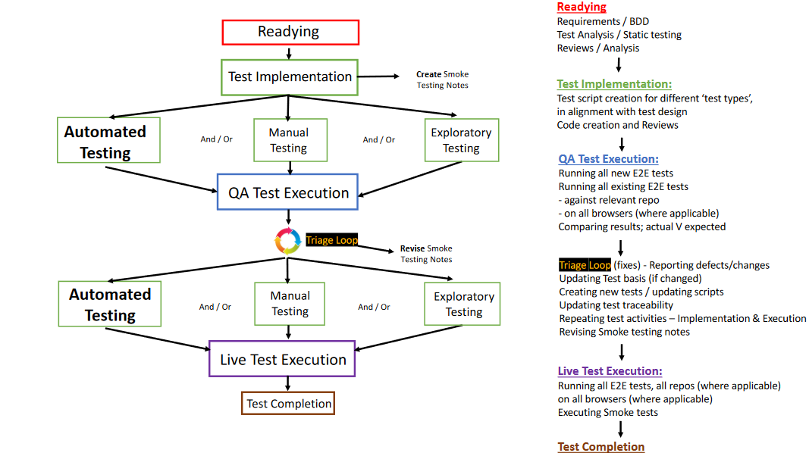

This diagram outlines WHEN we need to execute our End to End (E2E) Regression tests on QA and LIVE environments.  

## Test implementation

Please note, it is not mandatory to implement or execute all 'test types', such as automation, manual and exploratory testing. Our focus is on automated testing. We should only manually or exploratory test in the absence of automation, or in addition to it, and always to a purposeful objective. The type of testing implemented will be driven by many factors and is very heavily dependent on the individual backlog item. Smoke testing notes are often written or at least started in this phase, and later revised in the Smoke Test Implementation state. 

## What is the difference between Manual and exploratory testing?
In a nutshell, manual testing is generally very structured and rigid, it involves writing out test steps and then executing them. What it lacks is the ability for a tester to think outside the box and have the freedom to use their skills, experience and knowledge. Although manual testing can have its place and benefits, so can exploratory testing and it is a combination of these test types (including automation), which contribute to test coverage and overall quality and confidence in testing. 

For more information on Exploratory testing, please see: [Exploratory Testing](../Exploratory-Testing.md) 

For more information on the differences between Manual and Exploratory testing, please see: [Exploratory Testing Vs Scripted Testing](https://www.softwaretestinghelp.com/exploratory-testing-vs-scripted-testing/) 

## QA Test execution

This should involve:
- Running playwright tests on ALL browsers (where applicable) 

The above should be run against the relevant repo, in GitHub actions:

[EDEN - DAM E2E Tests](https://github.com/amdigital-co-uk/eden/actions/workflows/dam-e2e-tests.yml)

[EDEN - Clients manager E2E Tests](https://github.com/amdigital-co-uk/eden/actions/workflows/clients-e2e-tests.yml)

[qtui front end - Front End / CMS E2E Tests](https://github.com/amdigital-co-uk/qtui-front-end/actions/workflows/e2e-tests.yml)

[qtms-oai - OAI Open Archives Initiative (API) E2E Tests](https://github.com/amdigital-co-uk/qtms-oai/actions)

For more information, please also see the following document: [Process to follow when running E2E tests after releases](https://adammatthewdigital.sharepoint.com/:w:/s/Quartex/EQ9WdpmT6N5Om-iRay91EbIBXDjWW88nFHGPTX-ugRSAkw?e=NGIqpj)

## What is the triage Loop?

As a result of QA Test Execution, defects may be discovered which need to be fixed, deployed and re-tested. This may involve updating requirements, updating existing test scripts or writing new ones entirely. This triage loop continues until (ideally) there is no presence of defects and there is team confidence in the quality of the implementation. 

## Smoke Test implementation

Smoke test notes are often started in the Test implementation stage. However, the reason Smoke test Implementation is added after QA execution is a result of the possible Triage loop (explained above). If a defect is found which requires a change to development implementation, then a corresponding test will need to be updated or written (if no existing coverage). Ideally, we would be covering this with automation. However, it's also not a bad idea to have a smoke test note to manually verify it upon release. This is a 'sanity' test and gives further confidence in the quality. 

## Live Test execution

This should involve:

- Running ALL E2E tests, on all repos, (where applicable)
- Running E2E tests on ALL browsers (where applicable)
- Executing Smoke tests (usually on Chrome)

If any Bugs are found on Live environments then (depending on the Risk/Result of that bug) we either roll back to a previous deployment version or create a new Backlog Item to fix the Bug. 